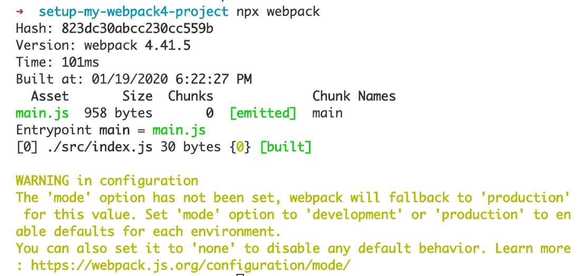
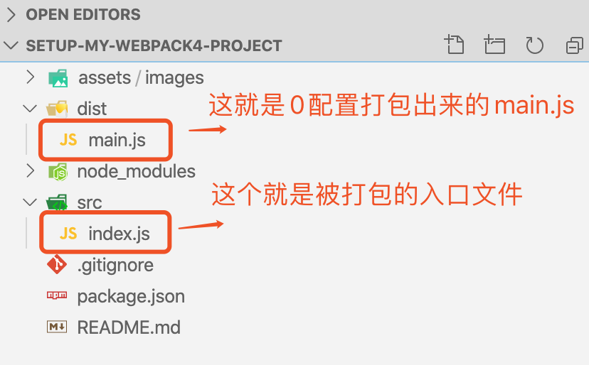

## 构建最初的项目目录结构

> 如下 😃

```markdown
+-- node_modules
+-- dist // dist 是 webpack 默认的打包输出目录.
+-- src
| +-- index.js // webpack 默认指定 src/index.js 为入口.
+-- package.json // 要记得安装 webpack4
+-- webpack.config.js // webpack 默认会找到根目录下名为 webpack.config.js 的配置文件并读取.
```

## 让我们来写些东西吧?

> Webpack4 是那么的优秀以至于我们甚至什么配置都可以不用写 😊

_这就意味着我们可以启动 webpack 而不用写任何的配置_





> 作为一个同样优秀的程序员，什么都不做还不如当一条咸鱼! 🙄

```javascript
const path = require('path');
const rootPath = process.cwd();

module.exports = {
	// 三个可选值: 'none' | 'development' | 'production'
	mode: 'none',
	entry: './src/index.js',
	output: {
		// 默认的文件名是 'main'
		filename: '[name].bundle.js',
		// 这里的path必须指定一个绝对路径
		path: path.join(rootPath, 'dist'),
	},
};
```

-   好了，亲爱的，快把上面的代码复制到你的 webpack.config.js 当中去吧！或许那样就可以摆脱成为一条咸鱼了叭 🤔 _(还记得刚才的命令吗？希望你认真再执行一遍，记得比较他们之间的差别哦)_
    [npx 是什么鬼？](https://www.ruanyifeng.com/blog/2019/02/npx.html)

## 作业

1. 比较一下，index.js 和输出的 main.js，他们之间的区别在哪，多出来的东西是做什么用的？
2. 试试在 index.js 中 require 一些模块，打包；再把 require 换成 es6 的 import，有区别吗？
3. 试一下 entry 传入一个对象，定义多入口，看看会发什么了什么？多入口可以用来做什么？
